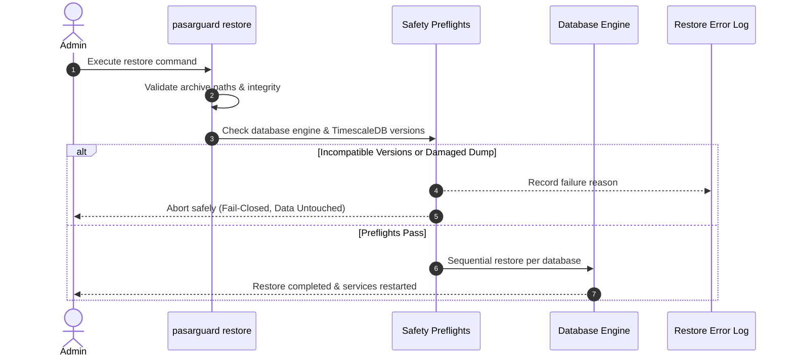

# PasarGuard Backup & Disaster Recovery Guide

Comprehensive guide to PasarGuard's backup architecture, automated Telegram backups, database dump consistency, and cross-version disaster recovery.

---

## Table of Contents
- [Overview](#overview)
- [What is Backed Up](#what-is-backed-up)
- [Database Backup Mechanics](#database-backup-mechanics)
  - [SQLite](#sqlite-wal-safe-checkpoints)
  - [MySQL & MariaDB](#mysql--mariadb)
  - [PostgreSQL & TimescaleDB](#postgresql--timescaledb)
- [Manual Backups](#manual-backups)
- [Automated Backup Service (Telegram & Cron)](#automated-backup-service-telegram--cron)
  - [Configuring Telegram Delivery](#configuring-telegram-delivery)
  - [Cron Schedule Intervals](#cron-schedule-intervals)
  - [Proxy Support for Filtered Networks](#proxy-support-for-filtered-networks)
- [Disaster Recovery & Restore](#disaster-recovery--restore)
  - [Interactive Restore Flow](#interactive-restore-flow)
  - [Pre-Restore Safety Preflights](#pre-restore-safety-preflights)
  - [TimescaleDB Version Compatibility & Safety Gate](#timescaledb-version-compatibility--safety-gate)
  - [Troubleshooting Restore Failures](#troubleshooting-restore-failures)

---

## Overview

PasarGuard features an enterprise-grade backup and recovery system designed to protect against data loss, disk corruption, and database schema migrations. Backups can be triggered manually on demand or scheduled automatically through cron with encrypted Telegram delivery.

---

## What is Backed Up

Every PasarGuard backup artifact encapsulates:
1. **Application Configuration**:
   - `docker-compose.yml`
   - `.env` (environment variables, secrets, and connection strings)
2. **Persistent State**:
   - `/var/lib/pasarguard/` (themes, panel assets, certificates, local states)
3. **Database Dumps**:
   - SQLite database snapshots and journal states.
   - Or complete database dumps (`db_backup.sql` or multi-database directory with `manifest.tsv`).

---

## Database Backup Mechanics

### SQLite (WAL-Safe Checkpoints)
Backing up an active SQLite database in WAL (Write-Ahead Log) mode can result in torn pages if done via standard file copy. PasarGuard handles this safely:
1. Performs a forced checkpoint: `PRAGMA wal_checkpoint(TRUNCATE);`
2. Creates an atomic snapshot of the main database file.
3. Validates the copy using `PRAGMA quick_check;`. Corrupt snapshots are immediately rejected.
4. Prevents stale `.sqlite-journal` or duplicate staging files from poisoning the restore.

### MySQL & MariaDB
- Executes `mysqldump` with `--single-transaction`, `--quick`, and `--routines`.
- Inspects the dump trailer to ensure the `-- Dump completed on <date>` marker is present before packaging.

### PostgreSQL & TimescaleDB
PasarGuard implements atomic multi-database dumping for PostgreSQL and TimescaleDB:
1. **Global Roles & Passwords**:
   - Dumps cluster globals (`globals.sql`).
   - During restore, sanitizes global passwords via `pg_filter_global_passwords` so that active administrative credentials on the target host are not inadvertently overwritten.
2. **Multi-Database Enumeration**:
   - Enumerates every user database in the cluster and dumps each into `pg_dump/db-<NNN>.sql`.
   - Generates a cryptographically tracked `manifest.tsv` containing database name, owner, TimescaleDB presence, and exact extension version:
     ```tsv
     appdb	appuser	1	db-001.sql	2.27.2
     ```
3. **Atomicity Guarantee**:
   - If any individual database dump fails or if the target application database is missing, the entire backup transaction is aborted and partial dumps are purged.

---

## Manual Backups

To initiate an immediate backup:

```bash
sudo pasarguard backup
```

The script will:
1. Snapshot application files and database data.
2. Package them into a ZIP or tarball archive under `/opt/pasarguard/backup/`.
3. Display the archive location, file size, and SHA256 checksum.

---

## Automated Backup Service (Telegram & Cron)

PasarGuard can dispatch automated backups to a Telegram chat or channel on a scheduled cron interval.

Launch the configuration wizard:
```bash
sudo pasarguard backup-service
```

### Configuring Telegram Delivery

In the wizard (or directly in `/opt/pasarguard/.env`), configure:
```env
BACKUP_SERVICE_ENABLED=true
BACKUP_TELEGRAM_BOT_KEY="123456789:ABCdefGHIjklMNOpqrsTUVwxyz"
BACKUP_TELEGRAM_CHAT_ID="-1001234567890"
# Note: TELEGRAM_TOKEN and TELEGRAM_CHAT_ID are also accepted as backward-compatible aliases.
```
*Note: Tokens are automatically masked in CLI output for security (e.g. `****TUVwxyz`).*

### Cron Schedule Intervals

The service maps friendly minute intervals into standard crontab entries:

| Interval | Schedule | Description |
| :--- | :--- | :--- |
| `5` | `*/5 * * * *` | Every 5 minutes |
| `15` | `*/15 * * * *` | Every 15 minutes |
| `30` | `*/30 * * * *` | Every 30 minutes |
| `60` | `0 * * * *` | Hourly |
| `120` | `0 */2 * * *` | Every 2 hours |
| `360` | `0 */6 * * *` | Every 6 hours |
| `720` | `0 */12 * * *` | Every 12 hours |
| `1440`| `0 0 * * *` | Daily at midnight |

### Proxy Support for Restricted Networks

If your host is in an environment with outbound network restrictions to Telegram servers, PasarGuard supports SOCKS5 and HTTP proxies:

```env
BACKUP_PROXY_ENABLED=true
BACKUP_PROXY_URL="socks5://127.0.0.1:1080"
# Or HTTP proxy:
# BACKUP_PROXY_URL="http://proxy.example.com:8080"
```

PasarGuard automatically validates the proxy scheme and routes `curl` requests through `--proxy "$BACKUP_PROXY_URL"`.

---

## Disaster Recovery & Restore



### Interactive Restore Flow

To restore a PasarGuard host from an existing backup:

```bash
sudo pasarguard restore
```

The restore engine will:
1. Scan `/opt/pasarguard/backup/` for available backup archives.
2. Present a numbered selection list with timestamps and file sizes.
3. Prompt for confirmation before any destructive change.
4. Stop panel services to prevent database writes during restoration.
5. Extract files to an isolated temporary staging directory (`/tmp/pasarguard_restore.XXXXXX`).

### Pre-Restore Safety Preflights

Before altering the active database or overwriting files:
- **Archive Entry Inspection**: Guards against path traversal vulnerabilities (rejects archives with leading `/` or `../` entries).
- **Dump Integrity Validation**: Verifies SQL dumps contain valid DDL/data and completed transaction markers.
- **Compose Preservation**: Snapshots the destination's active `docker-compose.yml` so that port customizations or proxy bindings are not destroyed by the restored archive.
- **Preflight Safety**: If archive validation fails during preflight inspection, existing databases and configuration files are left completely untouched, panel services are restarted, and detailed diagnostics are written to:
  ```
  /opt/pasarguard/backup/pasarguard_restore_error.log
  ```

### TimescaleDB Version Compatibility & Safety Gate

TimescaleDB hypertable metadata is tightly coupled to its extension version. Attempting to restore a TimescaleDB dump directly into an incompatible version will fail or risk corrupting hypertable catalogs.

PasarGuard enforces a strict fail-closed safety gate:
1. **Metadata Inspection**: Reads the source extension version from `manifest.tsv` or the version sidecar file (`db_backup.timescaledb-version`).
2. **Version Compatibility Verification**: Probes the destination PostgreSQL instance for the installed `timescaledb` extension version.
3. **Fail-Closed Mismatch Handling**: When the archived TimescaleDB version differs from the destination server's installed version, PasarGuard skips restoring that database before executing destructive `DROP DATABASE` or recreate commands, and exits with a failure status.
4. **Per-Database Rollback Boundary**: Databases listed in the backup manifest are restored sequentially. The no-change guarantee applies strictly to databases not yet reached or skipped; changes to earlier databases that have already been dropped and restored in the sequence are not rolled back if a subsequent database restore fails or is skipped.
- Clear operator guidance is displayed with the source and target version strings.
- Detailed diagnostics are written to `/opt/pasarguard/backup/pasarguard_restore_error.log`.

### Troubleshooting Restore Failures

If a restore fails, PasarGuard automatically dumps the error log to `stderr` and preserves it at:
```bash
cat /opt/pasarguard/backup/pasarguard_restore_error.log
```
Common causes:
- **Corrupt Archive**: Verify checksum of the downloaded file.
- **Password Mismatch**: If passwords were changed manually in `.env`, ensure the active DB user has superuser privileges to restore tables.
- **Disk Space**: Large multi-database dumps require sufficient space in `/tmp` and `/var/lib/docker`.
